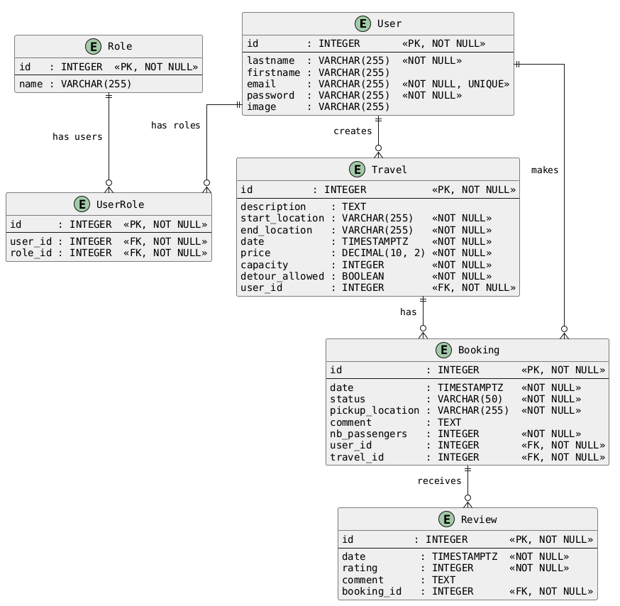
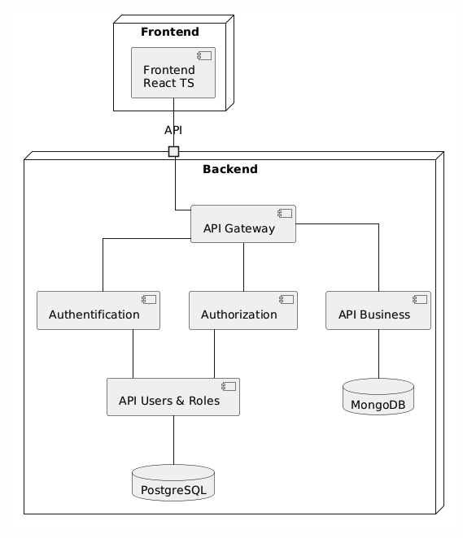
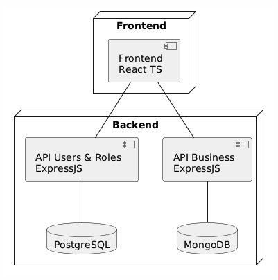

# Cahier des charges fonctionnel

Ceci est un appel d'offre. Nous ferons notre choix en fonction de la qualité et non de la quantité. Cependant, le cahier des charges fonctionnel est détaillé pour avoir une vue sur la direction du projet.

**O-Covoit** est une plateforme de covoiturage qui permet de mettre en relation des conducteurs et des passagers pour des trajets courts ou longs. Basée sur une intelligence artificielle, elle permet de trouver les meilleurs trajet pour chaque utilisateur, et inversement, trouver le max de passagers pour chaque conducteur. Les algorithmes de l'IA seront hautement personnalisables pour chaque utilisateur.

## Contraintes et spécifications

- Forte scalabilité possible : l'application doit être capable de gérer un grand nombre d'utilisateurs et d'être hébergée sur plusieurs serveurs
- Sécurité avancée : l'application devra gérer plusieurs types d'utilisateurs avec des droits différents
- API documentée : des services externes pourront utiliser l'API de l'application
- Fiabilité des évolutions : l'application devra être facilement maintenable et évolutive en gardant une qualité irréprochable
- Volumétrie des données : l'application devra pouvoir gérer un grand nombre de données
- Temps réel : réception des données, telles que l'emplacement des utilisateurs, en temps réel sur l'application
- Notifications : envoi de notifications en cas de réservation, nouveau trajet, etc.
- Conteneurisation : l'application devra être conteneurisée pour faciliter le déploiement
- Stack technique : la seule contrainte est le TypeScript. Le reste est à votre convenance.

## Fonctionnalités

Pour ne pas rendre public notre concept novateur, nous avons décidé de ne pas détailler les fonctionnalités de l'application. Cependant, nous avons listé les fonctionnalités classiques qui devront être présentes.

- Inscription et connexion
- Création et modification de trajets
- Recherche de trajets
- Gestion des réservations
- Gestion des avis

Une attention particulière sera portée sur les rôles d'un utilisateur. En effet, un utilisateur peut être à la fois conducteur et passager. Il peut également être administrateur de l'application.

Le front n'est pas à développer, mais il faudra tout de même le conteneuriser avec un template Vite.

## Proposition

### Architecture

Nous avons choisi une architecture en microservices, avec une API Gateway pour gérer les requêtes entrantes et sortantes. Chaque microservice est indépendant et contient sa propre base de données.

Justification :

- Scalabilité : chaque microservice peut être déployé sur un serveur différent
- Sécurité : chaque microservice peut être sécurisé indépendamment
- Fiabilité : chaque microservice peut être maintenu et évolué indépendamment
- Volumétrie : chaque microservice peut gérer sa propre volumétrie
- Évolutivité : Pour le début, un service pour les trajets/réservations/avis et un service pour les utilisateurs/roles suffisent. Ensuite, un service pour :
  - chaque ressource pour isoler les complexités métier
  - l'authentification pour gérer les tokens
  - l'autorisation pour gérer les droits de façon centralisée
  - d'autres features (notifications, etc.)

Nous utiliserons la méthodologie TDD pour garantir la fiabilité des évolutions.

Justification :

- Clarification : les besoins métiers seront clairement définis et les tests seront écrits avant le code
- Fiabilité : fiabilité des évolutions, chaque brique sera testée unitairement, l'application sera testée en intégration et de bout en bout
- Automatisation : Réduction des coûts de maintenance et des risques régression

La stack technique est la suivante :

- Langage commun : TypeScript
- BDD users & roles : PostgreSQL pour la robustesse et la fiabilité
- Frontend : React TS
- Backend : Express, framework simple et bénéficiant d'un large écosystème
  - API users & roles : Express + Postgresql + Swagger
  - API business (trajets, réservations et avis) : Express + Mongoose + Swagger
- BDD trajets, réservations et avis : MongoDB pour la flexibilité et la scalabilité
- Tests : Jest (Vitest pour le frontend)
- Conteneurisation : Docker compose, solution la plus populaire et la plus mature
- Versionning : Git, solution la plus populaire
- CI/CD : GitHub Actions s'intègre parfaitement dans les processus de développement classiques

### UMLs

Diagramme d'entités associations :

D'après les besoins exprimés, nous avons fait le choix de différencier 2 rôles utilisateurs.

- **Client** : Personne externe à l'entreprise qui utilise l'application
- **Administrateur** : Personne interne à l'entreprise qui gère l'application

Un avis est lié à une réservation. La réservation est liée à un utilisateur (passager) et à un trajet. Le trajet est lié à un utilisateur (conducteur).
L'auteur de l'avis est le passager qui a réservé le trajet. Les avis d'un conducteur sont les avis des réservations de ses trajets.

Schéma d'architecture de l'application après validation de notre proposition :

Schéma d'architecture de la proposition :

### Plan de tests

Voici le plan de tests détaillé pour l'inscription et la connexion :

| Test                                                          | Résultat attendu             | Statut |
| ------------------------------------------------------------- | ---------------------------- | ------ |
| Inscription avec un email déjà utilisé                        | 400 : email existant         | 🔴     |
| Inscription avec un email invalide                            | 400 : email incorrect        | 🔴     |
| Inscription avec un mot de passe faible                       | 400 : mot de passe faible    | 🔴     |
| Inscription avec un email libre et un mot de passe robuste    | 201 : Inscription réussie    | 🟢     |
| Connexion avec un email inexistant                            | 400 : email inexistant       | 🔴     |
| Connexion avec un email existant et un mot de passe incorrect | 400 : mot de passe incorrect | 🔴     |
| Connexion avec un email existant et un mot de passe correct   | 20x : Connexion réussie      | 🟢     |
