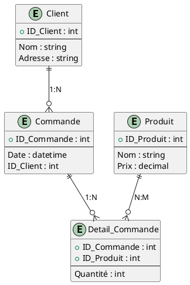

# **Fiche : Comment réaliser un ERD (Entity Relationship Diagram)**

## **Définition**

Un **ERD (Diagramme Entité-Relation)** est un schéma utilisé pour modéliser une base de données en représentant graphiquement les entités (tables), leurs attributs et les relations entre elles. Il permet de visualiser la structure logique d’un système de gestion de bases de données.

---

## **Étapes de réalisation d’un ERD**

### 1. **Identification des entités**

- **Entité** : Un objet ou concept pertinent à modéliser (exemple : un client, un produit, une commande).
- Ce sont souvent des **noms** au singulier (Client, Produit, Commande).
- Chaque entité correspondra généralement à une table dans la base de données.

### 2. **Définition des attributs**

- Les **attributs** sont les caractéristiques des entités (exemple : un client peut avoir un nom, une adresse, un numéro de téléphone).
- Un des attributs sera généralement l'**identifiant unique** de l’entité (exemple : `ID_Client` pour la table Client).

### 3. **Identification des relations entre les entités**

- Les **relations** représentent les liens entre différentes entités (exemple : une commande est passée par un client).
- Les types de relations incluent :
  - **1:1 (un à un)** : Une entité A est liée à une seule entité B et vice versa.
  - **1:N (un à plusieurs)** : Une entité A est liée à plusieurs entités B, mais une entité B est liée à une seule entité A.
  - **N:M (plusieurs à plusieurs)** : Plusieurs entités A sont liées à plusieurs entités B.

### 4. **Détermination des cardinalités**

- La **cardinalité** indique combien d’instances d’une entité peuvent être associées à une autre entité.
- Notation classique :
  - 0,1 : une entité peut être liée à zéro ou une entité.
  - 1,N : une entité est liée à une ou plusieurs entités.
  - 0,N : une entité peut être liée à zéro ou plusieurs entités.

### 5. **Identification des clés primaires et clés étrangères**

- **Clé primaire (Primary Key)** : Un attribut ou un ensemble d’attributs qui identifie de façon unique chaque instance d’une entité (exemple : `ID_Client`).
- **Clé étrangère (Foreign Key)** : Un attribut dans une entité qui correspond à la clé primaire d’une autre entité, représentant ainsi la relation (exemple : `ID_Client` dans la table Commande).

### 6. **Définition des relations N:M avec une table associative**

- Les relations N:M nécessitent une **table associative** (ou table de jointure) qui contiendra des clés étrangères pour chaque entité participant à la relation.

### 7. **Ajout des contraintes**

- Il est important de préciser les **contraintes** (exemple : une contrainte d’unicité, de non-nullité, etc.) pour garantir l’intégrité des données.

---

## **Exemple de diagramme ERD avec PlantUML**

Prenons l'exemple d'un système de gestion de commandes avec les entités suivantes :

1. **Entités** :

   - **Client** (ID_Client, Nom, Adresse)
   - **Produit** (ID_Produit, Nom, Prix)
   - **Commande** (ID_Commande, Date, ID_Client)
   - **Détail_Commande** (ID_Commande, ID_Produit, Quantité)

2. **Relations** :
   - Un **Client** peut passer plusieurs **Commandes** (1:N).
   - Une **Commande** peut inclure plusieurs **Produits**, et un **Produit** peut être commandé dans plusieurs **Commandes** (N:M via la table **Détail_Commande**).

### **Code PlantUML pour ce schéma :**

### **Explication du code** :

- Chaque entité est représentée par un bloc `entity` avec ses attributs.
- Les clés primaires sont identifiées avec un `+` devant leur nom.
- Les relations sont représentées par les connecteurs `||--o{`, avec des annotations pour les cardinalités (1:N, N:M).
- Une **table associative** `Detail_Commande` est utilisée pour modéliser la relation N:M entre **Commande** et **Produit**.

---

## **Outils pour créer un ERD avec PlantUML**

- **PlantUML** : Permet de générer des diagrammes à partir d'une description textuelle simple.
- **Visual Studio Code + Extension PlantUML** : Très pratique pour voir le rendu en direct.
- **PlantText** : Un outil en ligne pour écrire et visualiser du code PlantUML.

---

## **Conseils pratiques**

- **Clarifiez les exigences** : Discutez avec les utilisateurs finaux pour comprendre le domaine métier.
- **Simplifiez les relations** : Utilisez des tables associatives pour les relations complexes.
- **Validez le modèle** : Avant de passer à la phase de développement, validez le modèle avec les parties prenantes.

---

### **Ressources supplémentaires**

- Tutoriels sur l’utilisation de PlantUML : [PlantUML Documentation](http://plantuml.com/)
